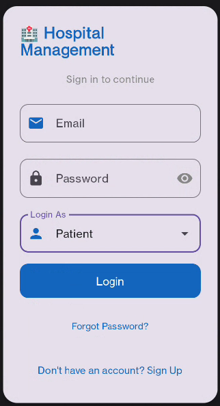
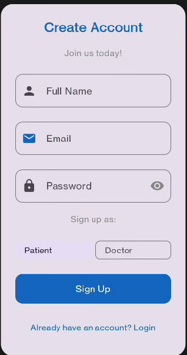
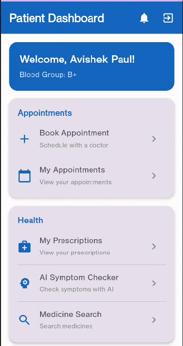
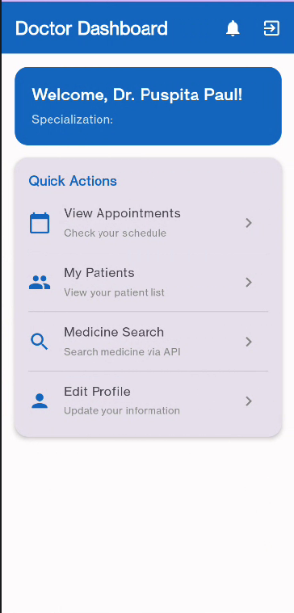
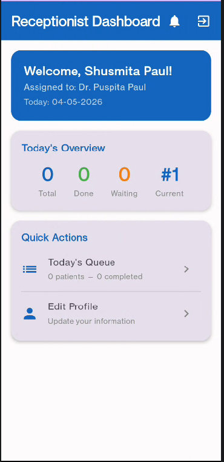
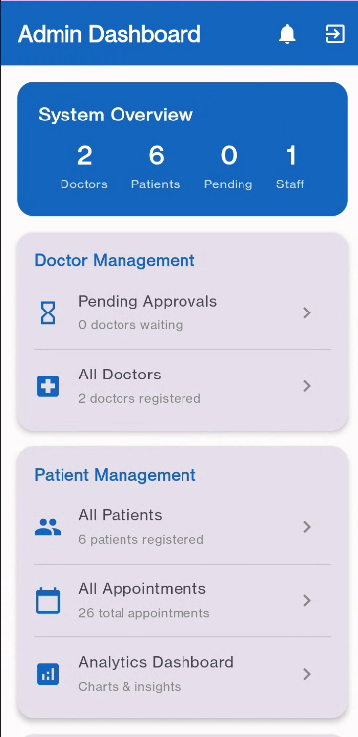

# 🏥 Hospital Management System

A full-featured Hospital Management System Android app built with Kotlin, Jetpack Compose, and Firebase.

## 📱 Screenshots

| Login | Sign Up | Patient Dashboard |
|-------|---------|-------------------|
|  |  |  |

| Doctor Dashboard | Receptionist Dashboard | Admin Dashboard |
|-----------------|----------------------|-----------------|
|  |  |  |

## ✨ Features

### 👨‍💼 Admin
- Dashboard with analytics
- Manage doctors, patients, receptionists
- Approve/reject doctor registrations
- View all appointments

### 👨‍⚕️ Doctor
- Personal dashboard
- View appointments and patients
- Write prescriptions
- Edit profile

### 👩‍💼 Receptionist
- Manage today's queue
- Book appointments for patients
- View patient details

### 🧑‍🤝‍🧑 Patient
- Book appointments
- View prescriptions
- AI Symptom Checker powered by Google Gemini
- Medicine search
- Appointment reminders

## 🛠️ Tech Stack
- Kotlin
- Jetpack Compose
- Firebase Auth
- Firebase Firestore
- Google Gemini AI
- Material 3

## 🚀 Setup

1. Clone the repo : https://github.com/DevAvi404/Hospital-Management-System.git
2. Create a Firebase project and download `google-services.json` into `/app`
3. Get a Gemini API key from https://aistudio.google.com/app/apikey
4. Add to `local.properties`: GEMINI_API_KEY=your_key_here
5. 5. Run the app!

## 👤 Developer
**varVoid** — [@DevAvi404](https://github.com/DevAvi404)

## 📄 License
MIT License
